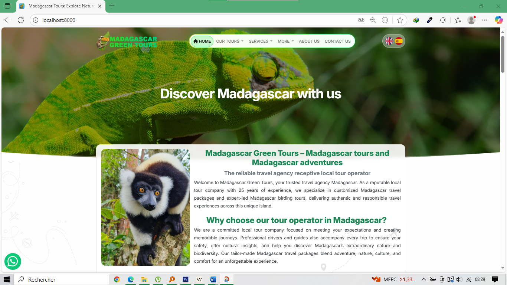

# MGT Website PHP/MySQL

This is a simple website built with PHP and MySQL database. It is designed to be a simple and easy to use website for a small business.

## Features

**Tourism website with multilingual support**, your **admin panel** should make it easy to manage all the content, media, and translations efficiently while staying secure and SEO-friendly.

Here’s a full list of **recommended features and modules** for your admin dashboard 👇

---

### 🧭 1. **Authentication & User Management**

**Purpose:** Secure access and control.
**Features:**

* Admin login/logout (with hashed passwords, e.g., bcrypt)
* Forgot password / password reset
* Role management (Admin, Editor, Translator, etc.)
* Activity logs (who edited what and when)

---

### 🌍 2. **Multilingual Content Management**

**Purpose:** Handle multilingual pages and SEO URLs.
**Features:**

* Manage content for each supported language (e.g., English, Spanish, French)
* Auto-generate SEO slugs per language (`/en/tours/wildlife`, `/es/tours/vida-silvestre`)
* Easy switch between translations while editing
* Missing translation alerts

---

### 🏝️ 3. **Tour Management**

**Purpose:** Add, edit, and organize tours displayed on the site.
**Fields to include:**

* Tour title (per language)
* Description (rich text, per language)
* Price, duration, difficulty level
* Category (e.g., Adventure, Culture, Nature)
* Location / region
* Itinerary (day-by-day content)
* Gallery (upload multiple images)
* SEO meta title & description
* Status (Draft / Published)

---

### 🏞️ 4. **Destination Management**

**Purpose:** For pages about tourist destinations or regions.
**Features:**

* Add/edit destinations with photos, maps, and details
* Link tours that visit each destination
* Multilingual descriptions and SEO settings

---

### 📰 5. **Blog / Articles Management**

**Purpose:** Improve SEO and user engagement.
**Features:**

* Create, edit, delete posts
* Categories & tags
* Featured image
* SEO fields (title, slug, description per language)
* Schedule post publication

---

### 🖼️ 6. **Media Manager**

**Purpose:** Manage images and files in one place.
**Features:**

* Upload, rename, delete images
* Folder organization
* Automatic compression / resizing for performance
* Generate thumbnail previews

---

### 📄 7. **Static Pages Editor**

**Purpose:** Manage “About”, “Contact”, “FAQ”, etc.
**Features:**

* WYSIWYG rich-text editor
* SEO-friendly fields (title, description, URL slug per language)
* Version history / undo

---

### 💬 8. **Testimonials / Reviews Management**

**Purpose:** Showcase client feedback.
**Features:**

* Add testimonials manually or approve user-submitted ones
* Include photo, name, nationality, rating, text (per language)
* Show/hide on site

---

### 📞 9. **Contact & Inquiry Management**

**Purpose:** Track messages from visitors.
**Features:**

* View messages sent from website contact forms
* Reply directly or export contacts
* Email notifications for new messages
* Mark inquiries as “replied” or “pending”

---

### 📈 10. **SEO & Analytics**

**Purpose:** Optimize content visibility.
**Features:**

* Edit meta title, description, and slug for all pages
* Upload sitemap.xml and robots.txt
* Google Analytics / Search Console integration
* Preview snippet (how it looks on Google)

---

### ⚙️ 11. **Settings**

**Purpose:** Control global configurations.
**Features:**

* Manage site logo, favicon, social links
* Manage available languages
* Contact info (email, phone, address)
* Footer and menu links
* API keys (e.g., Google Maps, TripAdvisor widgets)

---

### 🧩 12. **Dashboard Overview**

**Purpose:** Quick overview for admin.
**Widgets:**

* Total tours, destinations, blog posts
* Pending translations
* Latest inquiries
* Quick access to recent edits

---

### 🔐 13. **Security Features**

**Purpose:** Protect admin and data.
**Features:**

* CSRF protection
* XSS & SQL injection prevention
* Secure session management
* Limit login attempts / CAPTCHA
* Admin area access restricted by IP (optional)

---

### 🗃️ 14. **Database Backup & Restore**

**Purpose:** Easy recovery in case of issues.
**Features:**

* Export / import database
* Schedule automatic backups

---

Would you like me to give you a **recommended folder structure and database schema (MySQL)** for this admin system (with multilingual support included)?
That would help you start coding it directly in PHP/MySQL.

## Installation

1. Clone the repository.
2. Install the dependencies with `composer install`.
3. Create a database and import the `mgt_website.sql` file.
4. Configure the database connection in the `app/config/database.php` file.
5. Run the website with `php -S localhost:8000`.

## Notes

* This website uses the Bootstrap framework for its responsive design.
* This website uses the jQuery library for its JavaScript functionality.
* This website uses the PHPMailer library for sending emails from the contact form.
* This website uses the MySQL database for storing its data.